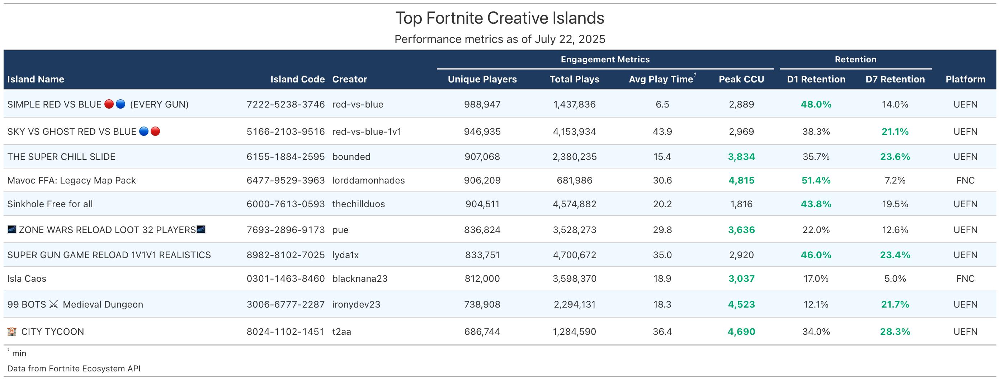

<p align="center">
  
</p>

# FortniteR

R client for the Fortnite Ecosystem API, providing access to island metadata and engagement metrics.

## Installation

```r
# Install from GitHub
devtools::install_github("econosopher/FortniteR")

# Or using pacman
if (!require(pacman)) install.packages("pacman")
pacman::p_load_gh("econosopher/FortniteR")
```

## Usage

**IMPORTANT**: This package uses real API data only. NO MOCK DATA is used.

The Fortnite Ecosystem API is PUBLIC and does NOT require authentication. The API documentation incorrectly mentions OAuth2, but all endpoints work without any authentication.

### Fetching Island Data

```r
library(FortniteR)

# Get list of islands
islands <- get_islands(limit = 50)

# Get all islands with pagination (up to 1000)
all_islands <- get_all_islands()

# Get specific island metadata
island_info <- get_island_metadata("XXXX-XXXX-XXXX")

# Get island metrics (plays, retention, etc.)
metrics <- get_island_metrics(
  code = "XXXX-XXXX-XXXX",
  start_date = Sys.Date() - 7,
  end_date = Sys.Date(),
  interval = "day"  # Options: "minute", "hour", "day"
)

# Estimate Fortnite DAU from a random island sample
dau_estimate <- estimate_fortnite_dau(
  date = Sys.Date() - 1,
  sample_size = 150,
  confidence_level = 0.95,  # tune confidence up/down
  overlap_adjustment = 1.4, # optional de-dup assumption across islands
  seed = 42
)

dau_estimate$summary

# Estimate a multi-metric daily time series (up to last 7 days)
# This reuses one sampled island set and makes one metrics request per island,
# which is much lighter than re-sampling per day.
ts_estimate <- estimate_fortnite_timeseries(
  start_date = Sys.Date() - 6,
  end_date = Sys.Date() - 1,
  metrics = c("unique_players", "plays", "peak_ccu"),
  sample_size = 150,
  confidence_level = getOption("FortniteR.confidence_level", 0.95),
  overlap_adjustment = 1.4,
  seed = 42
)

ts_estimate$summary
```

### Creating Visualizations

The package includes a script to create beautiful GT tables from the API data:

```bash
# Run this script to generate the top 10 islands table
Rscript scripts/01_top_10_islands_table.R
```

### Example Output

Here's an example of a GT table generated using real data from the Fortnite Ecosystem API:




*This table shows the top performing Fortnite Creative Islands ranked by unique players, displaying comprehensive engagement metrics (unique players, total plays, average play time, peak CCU) and retention data (D1 and D7 retention rates).*


## Features

- Fetch island listings with pagination
- Get detailed island metadata
- Retrieve engagement metrics (players, plays, retention, etc.)
- Estimate DAU with confidence intervals from random island sampling
- Estimate multi-metric time series from one sampled island frame (7-day API window)
- Support for different time intervals (day, hour, minute)
- Create beautiful GT tables with metrics
- No authentication required

## API Endpoints

- `/islands` - Returns basic island metadata (code, name, creator, platform, tags)
- `/islands/{code}` - Returns detailed metadata for a specific island
- `/islands/{code}/metrics/{interval}` - Returns engagement metrics at day/hour/minute intervals

## API Limitations

- Historical metrics data limited to 7 days
- Only public/discoverable islands available
- Minimum 5 unique players required for metrics data
- Some Epic games don't support favorites/recommendations
